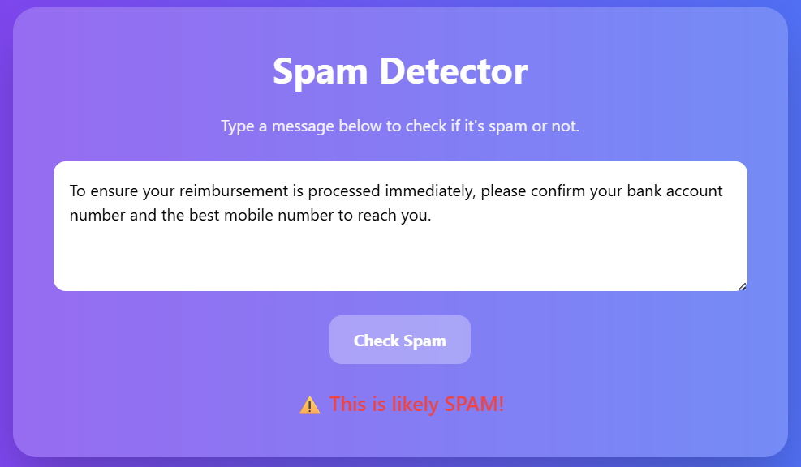

# Spam Detector

A simple **spam detection system** that classifies messages as **spam** or **ham**. This project includes a **frontend interface**, a **trained machine learning model**, and a **dataset** for testing. It’s designed for educational purposes and to demonstrate how spam detection works in real-world scenarios.

---

## **Features**

- **User-friendly frontend**: A responsive web interface (`index.html`) with animations where users can type a message and check if it’s spam.
- **Machine learning model**: Predicts whether a message is spam or ham.
- **Dataset**: Contains labeled messages (`spam` or `ham`) with features like:
  - Message text
  - Word count
  - Presence of suspicious keywords
  - Numbers, URLs, or special characters
- **Subtle spam detection**: Detects tricky spam messages that don’t include obvious links or prizes.
- **Responsive design**: Works on both desktop and mobile devices.
- **Animations & hover effects**: Modern UI with floating effects, fading text, and interactive buttons.

---

## **Demo**




---

## **Installation & Usage**

1. **Clone the repository**
```bash
git clone https://github.com/yourusername/spam-detector.git
cd spam-detector
